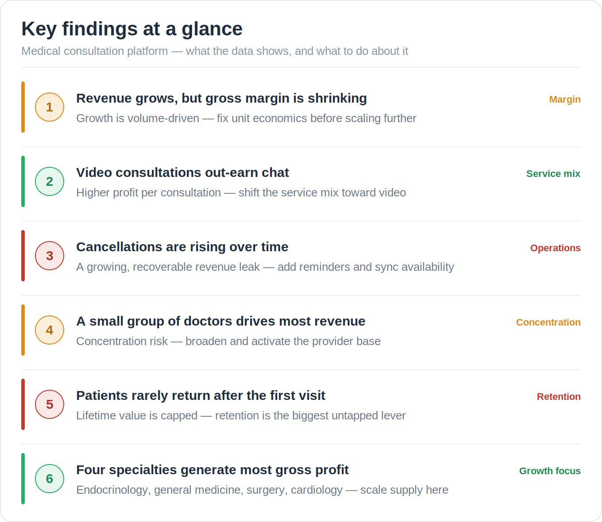

# Medical Consultation Platform — Financial Analysis (snapshot)

[](https://dmitriifed.github.io/medical-platform-financial-analysis/)

A financial analysis of an online medical consultation platform, built for and used by the business owner, investors, and finance team. Several of the findings below were acted on by the business immediately. It runs from raw CRM data through to an interactive dashboard, covering revenue, pricing, cost, margin, doctor economics, and patient retention.

> **Snapshot note:** This is a portfolio copy. Financial values are scaled and all IDs are anonymised. The data structure, distributions, and conclusions match the real project.

---

## Key findings



1. **Revenue is growing, but gross margin is shrinking.** The growth comes from volume rather than efficiency, so the unit economics need attention before scaling further.
2. **Video consultations earn more than chat.** Higher profit per consultation, which makes the case for shifting the mix toward video.
3. **Cancellations are rising.** That is lost revenue, and most of it is recoverable with reminders and better availability syncing.
4. **A small group of doctors brings in most of the revenue.** The concentration is a risk, and the active provider base needs widening.
5. **Most patients do not return after the first visit.** Lifetime value is capped, so retention is the largest opportunity.
6. **Four specialties produce most of the gross profit:** endocrinology, general medicine, surgery, and cardiology. That is where extra supply pays off.

Full write-up: [`reports/executive_summary.md`](reports/executive_summary.md), [`reports/key_findings.md`](reports/key_findings.md), [`reports/recommendations.md`](reports/recommendations.md).

---

## Live dashboard

**[Open the interactive dashboard](https://dmitriifed.github.io/medical-platform-financial-analysis/)**

26 interactive charts across 8 topics. No setup required, and it opens in any browser.

---

## What's in it

The analysis:
- Revenue against gross margin, showing where the unit economics slip
- Video versus chat, split by profitability
- Revenue lost to cancellations, and which doctors account for it
- Pareto curves for both doctors and patients
- Doctor profitability by specialty, as a treemap, grouped bars, and monthly trends
- A patient cohort retention matrix, by monthly cohort over 12 months

How it was built:
- Combines the CRM export with FX rates and specialty lookups
- Normalises every payment to EUR across RUB, USD, ILS, and USDT
- Rebuilds the whole dashboard from a single script, with no Jupyter needed
- Clips outliers and handles the specialty joins and cohort logic

---

## Analysis topics

| Topic | Question it answers |
|---|---|
| 0) Business overview | Is the business growing efficiently? |
| 1) Revenue | What drives the revenue mix? |
| 2) Pricing | How do video and chat prices differ? |
| 3) Volume & cancellation | How much revenue is lost to cancellations? |
| 4) Cost | What does doctor pay look like? |
| 5) Margin | Which services are most profitable? |
| 7) Doctor economics | Who generates the value, and how is it spread? |
| 8) Patient economics | Do patients come back? |

---

## Running it

```bash
git clone https://github.com/dmitriifed/medical-platform-financial-analysis.git
cd medical-platform-financial-analysis
pip install -r requirements.txt
python notebooks/run_viz.py   # writes visualisations/quick_viz_4.html, open it in any browser
```

---

## Project structure

```
medical-platform-financial-analysis/
├── data/
│   ├── processed/              # Scrambled CRM data
│   └── raw/hierarchy/          # Specialty grouping lookups
├── notebooks/
│   ├── quick_viz_4.ipynb       # Main analysis notebook
│   └── run_viz.py              # Runs the notebook and exports the HTML dashboard
├── reports/
│   ├── executive_summary.md
│   ├── key_findings.md
│   └── recommendations.md
├── docs/
│   ├── index.html              # GitHub Pages source (live dashboard)
│   └── findings_at_a_glance.png
├── requirements.txt
└── README.md
```

---

## Contributors

- [@dmitriifed](https://github.com/dmitriifed)
- [@sergey-berezovka](https://github.com/sergey-berezovka)
